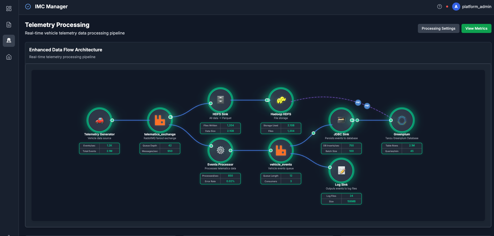
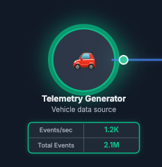
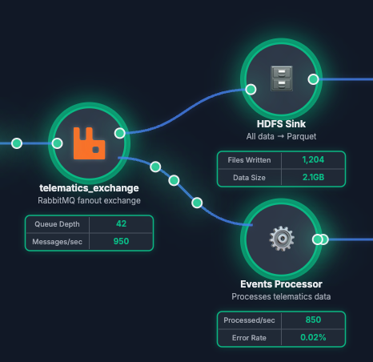
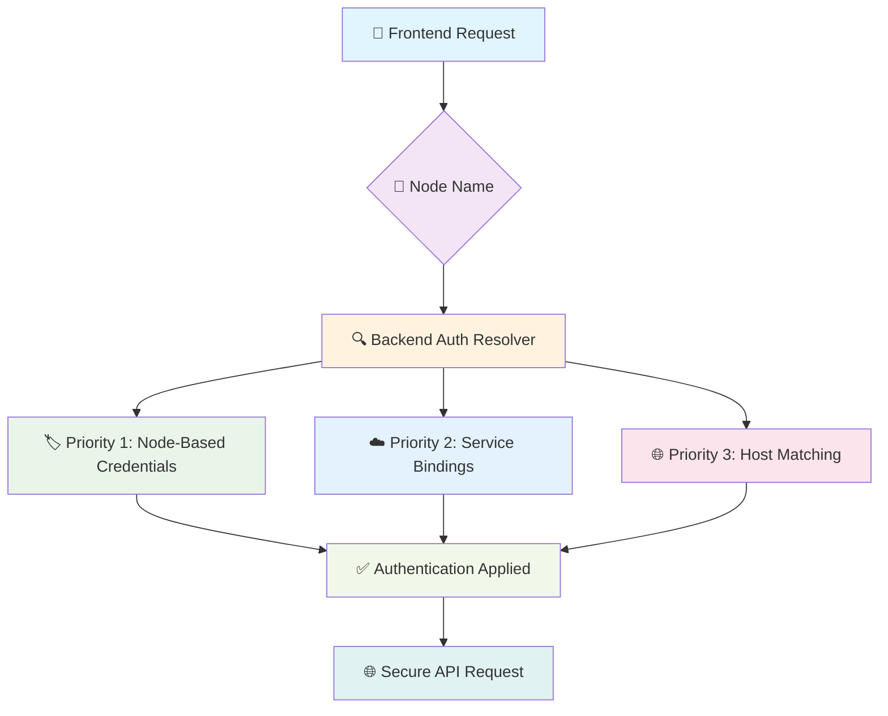

# 🎨 Diagram Designer

<div align="center">



**🚀 Interactive System Architecture Visualization Platform**

[](https://reactjs.org/)
[](https://www.typescriptlang.org/)
[](https://spring.io/projects/spring-boot)
[](https://openjdk.org/)
[](https://vitejs.dev/)
[](https://reactflow.dev/)
[](https://tailwindcss.com/)

*Create stunning, interactive system diagrams with real-time metrics, animated particles, and enterprise-grade authentication*

**✨ NEW: Interactive Detail Modals + Hybrid Authentication System!**

[🌐 Live Demo](#-deployment) | [🔐 Authentication Guide](#-advanced-authentication-system) | [📖 Documentation](#-configuration-guide) | [🚀 Quick Start](#-quick-start)

</div>

---

## ✨ Features

<table>
<tr>
<td width="50%">

### 🎯 **Core Features**
- 🏗️ **Interactive Node-Based Diagrams**
- 📊 **Real-Time Metrics Display**
- ✨ **Animated Particle Flows**
- 🔄 **Live Status Monitoring**
- 🎨 **Customizable Styling & Themes**
- 🔗 **Smart Connection Management**
- 📱 **Responsive Design**

</td>
<td width="50%">

### 🚀 **Advanced Features**
- 🖱️ **Drag & Drop Positioning**
- 💾 **Persistent Layout Storage**
- 📂 **Multiple Diagram Support**
- 🔧 **JSON Configuration Editor**
- 📍 **Live Coordinate Display**
- 🌐 **Clickable Components**
- 🎯 **Interactive Detail Modals**
- ☁️ **Cloud Foundry Ready**

</td>
</tr>
</table>

---

## 🎥 Preview

<div align="center">


*Main diagram interface with animated particles and real-time metrics*


*Comprehensive settings and JSON editor*

</div>

---

## 🏗️ Architecture

This application uses a **hybrid Spring Boot + React architecture** for maximum flexibility and security:

### 🎯 **Frontend (React + TypeScript)**
- **Interactive UI**: Built with ReactFlow for diagram visualization
- **Real-time Updates**: WebSocket connections for live metrics
- **Drag & Drop**: Interactive positioning with persistent storage
- **Multi-diagram Support**: Dynamic switching between configurations

### ⚙️ **Backend (Spring Boot + Java 21)**
- **Secure Proxy**: Handles all external API calls with authentication
- **Configuration Processing**: Variable substitution and JSON processing
- **Multi-format Auth**: Supports Basic, Bearer, API Key, and custom headers
- **Flexible Deployment**: Works locally and on Cloud Foundry

### 🔒 **Enterprise Security Features**
- **🚫 Zero Client-side Secrets**: All credentials handled server-side
- **🎯 Node-Based Authentication**: Generic credentials using node names
- **☁️ Service Registry Integration**: Automatic CF service binding support
- **🛡️ Multiple Auth Methods**: Basic, Bearer, API Key, and custom headers
- **🧠 Smart Credential Resolution**: Priority-based authentication with fallbacks
- **🔄 Dynamic Discovery**: Automatic service URL and credential resolution
- **🔐 Variable Substitution**: Secure runtime replacement of `${VARIABLES}`
- **🛡️ Enhanced CORS Protection**: Configurable cross-origin policies

### 📁 **Directory Structure**
```
diagram-designer/
├── configs/                    # JSON diagram configurations
├── diagram-designer-api/       # Spring Boot application module
│   ├── src/main/java/         # Java source code
│   ├── manifest.yml           # Cloud Foundry manifest
│   └── pom.xml               # Module Maven configuration
├── frontend/                   # React application
│   ├── src/                   # TypeScript source code
│   └── dist/                  # Built frontend assets
├── pom.xml                    # Parent Maven configuration
├── .config.env.template       # Environment variables template
├── .config.env               # Local environment variables (git-ignored)
└── deploy.sh                 # Deployment script
```

---

## 🚀 Quick Start

### 📋 Prerequisites

- **Java** 21+
- **Maven** 3.9+
- **Node.js** 18+
- **npm** or **yarn**
- **Cloud Foundry CLI** (for deployment)

### ⚡ Installation & Development

```bash
# 🔄 Clone the repository
git clone <repository-url>
cd diagram-designer

# 🔧 Set up configuration
cp .config.env.template .config.env
# Edit .config.env with your service credentials (node-based authentication)

# 🎯 Start local development (Spring Boot + React)
./deploy-local.sh
```

**🌐 Open your browser to:**
- Frontend dev server: `http://localhost:5173`
- Backend API: `http://localhost:3001`

### 🏗️ Build & Deploy

```bash
# 📦 Production build (served locally on :8080)
./deploy-local-prod.sh

# ☁️ Deploy to Cloud Foundry
./deploy.sh
```

---

## 🎨 Component Gallery

### 🎭 **Icon Types Supported**

<table>
<tr>
<td align="center"><h4>📱 FontAwesome</h4></td>
<td align="center"><h4>🖼️ Local Images</h4></td>
<td align="center"><h4>😀 Emoji Icons</h4></td>
</tr>
<tr>
<td>

```json
{
  "icon": "fas fa-server",
  "icon": "fas fa-database",
  "icon": "fas fa-cloud"
}
```

</td>
<td>

```json
{
  "icon": "/assets/icons/rabbitmq.svg",
  "icon": "/assets/icons/hadoop.svg",
  "icon": "/assets/icons/tanzu.png"
}
```

</td>
<td>

```json
{
  "icon": "🚗",
  "icon": "🗄️", 
  "icon": "⚙️",
  "icon": "🗃️",
  "icon": "📝"
}
```

</td>
</tr>
</table>

### 🎨 **Connection Styles**

| Type | Visual | Description |
|------|--------|-------------|
| **🔗 Default** | `━━━━━` | Standard ReactFlow edges |
| **🌊 Curved** | `╭─────╮` | Smooth curved lines |
| **📐 Step** | `┌──┐` | Angular stepped lines |
| **➡️ Straight** | `─────` | Direct straight lines |
| **✨ Particle** | `━✨━✨━` | Animated particle flows |

---

## 📊 Configuration Guide

### 🔧 **Global Settings**

```json
{
  "config": {
    "layout": "horizontal",           // 📐 Layout direction
    "updateInterval": 30000,         // ⏰ Metrics refresh rate (ms)
    "title": "My System Diagram",    // 📋 Diagram title
    "nodeGlow": {                    // ✨ Global glow effects
      "enabled": true,               // 🔘 Enable glow
      "intensity": 8,                // 💡 Glow strength (1-20)
      "spread": 12                   // 📏 Glow radius (px)
    }
  }
}
```

### 🏗️ **Node Configuration**

#### **📋 Required Properties**

| Property | Type | Description | Example |
|----------|------|-------------|---------|
| **🏷️ name** | `string` | Unique identifier | `"webserver"` |
| **📝 displayName** | `string` | Display name | `"Web Server"` |
| **📄 description** | `string` | Component description | `"Frontend web server"` |
| **🎨 icon** | `string` | Icon specification | `"fas fa-server"` |
| **📊 dataGrid** | `array` | Metrics configuration | `[{...}]` |

#### **⚙️ Optional Properties**

<details>
<summary><b>📍 Position Settings</b></summary>

```json
{
  "position": {
    "x": 100,    // 📐 X coordinate
    "y": 200     // 📐 Y coordinate
  }
}
```
</details>

<details>
<summary><b>🔗 Connection Configuration</b></summary>

```json
{
  "connectTo": ["NodeName"],           // 🔗 Simple connection
  "connectTo": [{                      // 🔧 Advanced connection
    "target": "NodeName",              // 🎯 Target node
    "outputHandle": 0,                 // 📤 Output handle index
    "inputHandle": 0                   // 📥 Input handle index
  }]
}
```

**🧠 Connection Logic:**
- 📊 **Right-to-Left Definition**: Node B connects TO Node A
- 🔄 **Visual Flow**: Left to Right (A → B)
- ⚡ **Data Flow**: A sends data TO B

</details>

<details>
<summary><b>✨ Particle Animation</b></summary>

```json
{
  "particles": {
    "enabled": true,        // 🔘 Enable particles
    "speed": 5,            // 🏃 Speed (1=slow, 10=fast)
    "count": 5,            // 🔢 Particle count
    "color": "#3498db",    // 🎨 Particle color
    "direction": "source", // 📍 Flow direction
    "glow": true,          // ✨ Glow effect
    "pulse": true          // 💓 Pulsing animation
  }
}
```

**🎯 Direction Options:**
- **📤 source**: Particles flow OUT of this node
- **📥 target**: Particles flow INTO this node

</details>

<details>
<summary><b>🔌 Handle Configuration</b></summary>

```json
{
  "handles": {
    "input": 2,     // 📥 Left side handles
    "output": 3     // 📤 Right side handles
  }
}
```
</details>

<details>
<summary><b>🔄 Status Monitoring</b></summary>

```json
{
  "status": {
    "url": "https://api.example.com/health",    // 🌐 Health endpoint
    "key": "bearer-token-123",                  // 🔐 Auth token
    "valueField": "status",                     // 📊 Status field
    "upValue": "healthy",                       // ✅ "Up" value
    "downValue": "unhealthy",                   // ❌ "Down" value
    "updateInterval": 10000                     // ⏰ Check interval
  }
}
```
</details>

<details>
<summary><b>🌐 Clickable Links</b></summary>

```json
{
  "url": "https://dashboard.example.com"       // 🔗 Click destination
}
```

- 🖱️ **Click Action**: Opens URL in new tab
- 🎨 **Visual Feedback**: Hover effects and pointer cursor
- 🛡️ **Secure**: Opens in new window/tab

</details>

### 📊 **Metrics Configuration**

```json
{
  "dataGrid": [
    {
      "label": "CPU Usage",                    // 📋 Metric label
      "key": "cpu-api-key",                    // 🔑 API key
      "url": "https://api.example.com/cpu",    // 🌐 Data endpoint
      "valueField": "percentage"               // 📊 JSON field to extract
    }
  ]
}
```

---

## 🎯 Interactive Detail Modals

### 🚀 **NEW: Clickable Node Detail System**

Transform your static diagrams into interactive documentation with rich, customizable detail modals that appear when users click on nodes.

<div align="center">

**📋 Features Overview**

| Feature | Description | Configuration |
|---------|-------------|---------------|
| **🎯 Multiple Click Behaviors** | Modal, direct URL, or hybrid modes | `clickBehavior: "modal"` |
| **📊 Rich Content Sections** | Info, metrics, status, logs, custom HTML | JSON-based templates |
| **🔗 Quick Action Links** | Primary, secondary, and external links | Styled button links |
| **🖼️ Custom Pages** | Embedded iframes, HTML, or markdown | Full-screen custom content |
| **📱 Responsive Design** | Mobile-friendly modal layout | Portal-based rendering |

</div>

---

### 🎛️ **Click Behavior Configuration**

Control how users interact with your diagram nodes:

```json
{
  "name": "myService",
  "clickBehavior": "modal",    // Options: "modal" | "url" | "both"
  "url": "https://dashboard.example.com/myservice"
}
```

<table>
<tr>
<th width="25%">🎯 Behavior</th>
<th width="35%">🖱️ User Action</th>
<th width="40%">💡 Use Case</th>
</tr>
<tr>
<td><strong>🎯 modal</strong> (default)</td>
<td>Click opens detail modal</td>
<td>Comprehensive service documentation</td>
</tr>
<tr>
<td><strong>🔗 url</strong></td>
<td>Click opens external URL</td>
<td>Direct dashboard access</td>
</tr>
<tr>
<td><strong>🎪 both</strong></td>
<td>Click = modal<br>Ctrl+Click = URL</td>
<td>Best of both worlds</td>
</tr>
</table>

---

### 📋 **Detail Configuration Structure**

Create rich service documentation by adding detail configuration files:

#### **📁 File Location**
```bash
configs/details/{NodeName}.json
```

#### **🏗️ Basic Structure**
```json
{
  "title": "Service Display Name",
  "description": "Brief service description",
  "sections": [
    {
      "title": "📊 Live Metrics",
      "type": "metrics",
      "icon": "📊",
      "content": "<div>Custom HTML content...</div>"
    },
    {
      "title": "🔧 Configuration",
      "type": "info",
      "icon": "⚙️",
      "content": "<div>Service configuration details...</div>"
    }
  ],
  "links": [
    {
      "label": "🖥️ Dashboard",
      "url": "https://dashboard.example.com",
      "type": "primary"
    }
  ]
}
```

---

### 🎨 **Content Section Types**

<table>
<tr>
<th width="15%">🏷️ Type</th>
<th width="25%">🎯 Purpose</th>
<th width="35%">💡 Example Usage</th>
<th width="25%">🎨 Styling</th>
</tr>
<tr>
<td><strong>📊 metrics</strong></td>
<td>Live performance data</td>
<td>CPU, memory, throughput stats</td>
<td>Grid layouts, progress bars</td>
</tr>
<tr>
<td><strong>ℹ️ info</strong></td>
<td>Static configuration data</td>
<td>Version, settings, properties</td>
<td>Key-value pairs, tables</td>
</tr>
<tr>
<td><strong>🔄 status</strong></td>
<td>Current operational state</td>
<td>Health checks, connection status</td>
<td>Status indicators, badges</td>
</tr>
<tr>
<td><strong>📝 logs</strong></td>
<td>Recent activity logs</td>
<td>Error logs, audit trails</td>
<td>Console-style formatting</td>
</tr>
<tr>
<td><strong>🎯 custom</strong></td>
<td>Any custom HTML content</td>
<td>Charts, embedded widgets</td>
<td>Full Tailwind CSS support</td>
</tr>
</table>

---

### 🔗 **Quick Action Links**

Add convenient action buttons to your modals:

```json
{
  "links": [
    {
      "label": "🖥️ Main Dashboard",
      "url": "https://dashboard.example.com",
      "icon": "🖥️",
      "type": "primary"       // Blue primary button
    },
    {
      "label": "📊 Metrics View",
      "url": "https://metrics.example.com",
      "icon": "📊",
      "type": "secondary"     // Gray secondary button
    },
    {
      "label": "📋 Documentation",
      "url": "https://docs.example.com",
      "icon": "📋",
      "type": "external"      // Green external link
    }
  ]
}
```

**🎨 Link Types:**
- **🔵 primary**: Main action (blue, prominent)
- **⚫ secondary**: Additional actions (gray)
- **🟢 external**: External resources (green)

---

### 🖼️ **Custom Page Embeds**

Embed full external content directly in modals:

```json
{
  "customPage": {
    "type": "iframe",
    "content": "https://dashboard.example.com/embed"
  }
}
```

**📋 Custom Page Types:**
- **🖼️ iframe**: Embed external dashboards or web apps
- **📄 html**: Direct HTML content injection
- **📝 markdown**: Markdown content (with parser)

---

### 🎯 **Pre-Built Templates**

Get started quickly with our comprehensive templates:

<details>
<summary><strong>📊 Database Service Template (JDBCSink.json)</strong></summary>

Features connection pool metrics, transaction logs, performance dashboards, and status monitoring.

```json
{
  "title": "JDBC Database Sink",
  "sections": [
    {
      "title": "📊 Connection Pool Metrics",
      "type": "metrics",
      "content": "Active connections, throughput, latency metrics..."
    },
    {
      "title": "🔍 Recent Transaction Log",
      "type": "logs",
      "content": "Console-style transaction history..."
    }
  ]
}
```

</details>

<details>
<summary><strong>📈 Analytics Service Template (EventsProcessor.json)</strong></summary>

Processing metrics, event flow status, rules configuration, and activity logs.

```json
{
  "title": "Vehicle Events Processor",
  "sections": [
    {
      "title": "⚡ Processing Metrics",
      "type": "metrics",
      "content": "Events/sec, processing time, queue depths..."
    },
    {
      "title": "🔄 Event Flow Status",
      "type": "status",
      "content": "Stream status indicators and health checks..."
    }
  ]
}
```

</details>

<details>
<summary><strong>🗄️ Data Warehouse Template (GreenplumWarehouse.json)</strong></summary>

Simple template for data warehouse services with cluster statistics and configuration details.

```json
{
  "title": "Greenplum Data Warehouse",
  "sections": [
    {
      "title": "📊 Cluster Statistics",
      "type": "metrics",
      "content": "Segment count, data size, query rates..."
    }
  ]
}
```

</details>

<details>
<summary><strong>🔧 Developer Template (TEMPLATE.json)</strong></summary>

Complete template with all section types, comprehensive documentation, and examples.

- ✅ All section types demonstrated
- 📖 Inline documentation and comments
- 🎨 Styling examples with Tailwind CSS
- 🔧 Ready to copy and customize

</details>

---

### 🚀 **Quick Setup Guide**

<div align="center">

| Step | Action | File/Command |
|------|--------|--------------|
| **1️⃣** | 🗃️ Create detail config | `configs/details/MyService.json` |
| **2️⃣** | 🎯 Set click behavior | `"clickBehavior": "modal"` in main config |
| **3️⃣** | 🎨 Design content sections | Use templates as starting point |
| **4️⃣** | 🚀 Deploy and test | `./deploy.sh` |

</div>

#### 🎯 **Example Workflow**

```bash
# 1. Copy template for your service
cp configs/details/TEMPLATE.json configs/details/MyDatabaseService.json

# 2. Edit your service configuration
# Add: "clickBehavior": "modal" to your main diagram config

# 3. Customize the detail template
# - Update title, description, sections
# - Add your service-specific metrics
# - Include relevant dashboard links

# 4. Deploy
./deploy.sh

# 5. Test by clicking your node - modal appears! 🎉
```

---

### 💡 **Pro Tips**

<table>
<tr>
<td width="50%">

**🎨 Content Styling**
- Use Tailwind CSS classes for consistent styling
- Color-code sections: blue for metrics, green for status
- Include icons in section titles for visual appeal
- Use grid layouts for metric displays

**🔄 Dynamic Content**
- Metrics refresh automatically every 30 seconds
- Status indicators show real-time health
- Log sections can show recent activity
- Custom sections support any HTML content

</td>
<td width="50%">

**📱 User Experience**
- Modals render using React Portal for proper layering
- Click outside modal to close
- Responsive design works on mobile devices
- Keyboard shortcuts: Escape to close

**🔧 Development**
- Hot reload during development shows config changes
- JSON validation prevents invalid configurations
- Console logging helps debug content issues
- Template comments explain each section type

</td>
</tr>
</table>

---

### 🌟 **Benefits**

<div align="center">

| 📊 **Rich Documentation** | 🚀 **Zero Code Changes** | 🎯 **User Friendly** |
|---------------------------|--------------------------|----------------------|
| Transform static diagrams | Add detailed views without | Intuitive click interactions |
| into interactive docs | touching application code | with professional modals |

| 🔧 **Highly Customizable** | 📱 **Production Ready** | 🎨 **Beautiful Design** |
|----------------------------|-------------------------|----------------------|
| JSON-based configuration | Portal rendering, responsive | Tailwind CSS styling, |
| supports any content type | design, enterprise security | consistent visual theme |

</div>

---

## 🎨 Styling & Themes

### 🌈 **Color Palette**

| Color | Hex | Usage |
|-------|-----|-------|
| 🔵 **Primary Blue** | `#3498db` | Default connections |
| 🟢 **Success Green** | `#2ecc71` | Status indicators |
| 🔴 **Error Red** | `#e74c3c` | Error states |
| 🟠 **Warning Orange** | `#f39c12` | Warnings |
| 🟣 **Accent Purple** | `#9b59b6` | Special highlights |

### ✨ **Glow Effects**

```json
{
  "nodeGlow": {
    "enabled": true,        // 🔘 Master toggle
    "intensity": 8,         // 💡 Brightness (1-20)
    "spread": 12           // 📏 Radius (pixels)
  }
}
```

**🎨 Glow Colors**: Automatically derived from node circle colors

---

## 🛠️ Advanced Features

### 📂 **Multi-Diagram Support**

- 🗂️ **Automatic Discovery**: Scans `configs/` directory for JSON files
- 🔄 **Dynamic Switching**: Change diagrams without refresh
- 💾 **Persistent Selection**: Remembers last selected diagram
- 🚀 **Auto-Detection**: New JSON files automatically appear in selector
- 🔒 **Secure Variable Substitution**: Environment variables injected at runtime

#### 🔄 **Auto-Detection Workflow**

1. **📁 Add JSON File**: Place your diagram JSON file in `configs/`
2. **🔧 Configure Variables**: Update `.config.env` with any new credentials
3. **✨ Auto-Appear**: Your diagram automatically appears in the selector dropdown
4. **🎯 Select & Use**: Choose your diagram from the dropdown and start using it

**Example:**
```bash
# Add your new diagram file
cp my-diagram.json configs/

# Add credentials to configuration
echo "MYSERVICE_API_KEY=abc123" >> .config.env

# Your diagram now appears in the UI! 🎉
```

### 🖱️ **Interactive Positioning**

- 🏃 **Drag & Drop**: Move components freely
- 📍 **Live Coordinates**: Optional coordinate display while dragging
- 💾 **Position Persistence**: Saves positions automatically
- 📁 **Layout Export**: Download current layout as JSON

### 🔧 **JSON Configuration Editor**

- 👁️ **View Mode**: Read-only formatted display
- ✏️ **Edit Mode**: Full text editor with syntax validation
- 🔄 **Live Position Merge**: Automatically includes current positions
- 💾 **Safe Download**: Validation prevents invalid JSON export

---

## 🌐 Deployment

### 🏠 **Local Development**

```bash
# 🔧 Development server with hot reload (Spring Boot + React)
./deploy-local.sh

# 🏭 Production build served locally
./deploy-local-prod.sh
```

### ☁️ **Enterprise Cloud Foundry Deployment**

<div align="center">

#### 🚀 **One-Command Deployment with Service Discovery**

</div>

```bash
# 🚀 Deploy to Cloud Foundry with automatic service binding
./deploy.sh
```

**📋 Deployment Features:**
- 🏗️ **Automated Build**: Maven builds both backend and frontend
- 📦 **Asset Optimization**: Vite optimizes frontend assets
- ☁️ **Service Binding**: Automatically binds to `imc-services` and `messaging` services
- 🔐 **Credential Injection**: Environment variables set from `.config.env`
- 🔄 **Zero-Downtime**: Rolling deployment with health checks

---

#### 🛠️ **Service Binding Configuration**

The application automatically connects to Cloud Foundry services:

<table>
<tr>
<th width="30%">🏷️ Service</th>
<th width="25%">📋 Binding Name</th>
<th width="45%">🔧 What It Provides</th>
</tr>
<tr>
<td><strong>🗂️ Service Registry</strong></td>
<td><code>imc-services</code></td>
<td>🔍 Service discovery and URL resolution<br>📡 Dynamic service endpoints</td>
</tr>
<tr>
<td><strong>🐰 Message Queue</strong></td>
<td><code>messaging-c856b29a-...</code></td>
<td>🔐 RabbitMQ credentials and URLs<br>📊 Management API endpoints</td>
</tr>
</table>

**📋 Manifest Configuration:**
```yaml
# diagram-designer-api/manifest.yml
services:
  - imc-services                    # 📡 Service Registry
  - messaging-c856b29a-1c7e-4fd5    # 🐰 RabbitMQ
```

---

#### 🔐 **Advanced Environment Setup**

<details>
<summary><strong>🚀 Automatic (Recommended)</strong></summary>

```bash
# 📝 Add credentials to .config.env
echo "MONITORING_API_KEY=sk_live_abc123" >> .config.env
echo "GRAFANA_BEARER_TOKEN=eyJ0eXAi..." >> .config.env

# 🚀 Deploy (automatically handles everything)
./deploy.sh
```

**✨ What happens automatically:**
- 🔍 Scans `.config.env` for authentication credentials
- 🔐 Sets only security-related environment variables in CF
- ☁️ Binds to configured services
- 🔄 Restarts application with new configuration

</details>

<details>
<summary><strong>🔧 Manual Service Management</strong></summary>

```bash
# 🔗 Bind additional services
cf bind-service diagram-designer my-monitoring-service
cf bind-service diagram-designer my-database-service

# 🔐 Set additional environment variables
cf set-env diagram-designer CUSTOM_API_KEY "secret_key"
cf set-env diagram-designer MONITORING_TOKEN "monitor_token"

# 🔄 Restart to apply changes
cf restart diagram-designer
```

</details>

<details>
<summary><strong>🔍 Service Discovery Verification</strong></summary>

```bash
# 📋 Check bound services
cf services | grep diagram-designer

# 🔍 Verify service credentials
cf env diagram-designer | grep -A 20 VCAP_SERVICES

# 📊 Check application health
cf app diagram-designer
```

</details>

---

#### 🌟 **Deployment Benefits**

<table>
<tr>
<td width="50%">

**🔄 Automatic Service Discovery**
- Services bound via `cf bind-service` are auto-discovered
- No manual URL configuration needed
- Platform-managed credential rotation

**🔐 Enhanced Security**
- Credentials never stored in code
- Environment variable isolation
- Audit trail for all changes

</td>
<td width="50%">

**🚀 Zero-Configuration Services**
- RabbitMQ authentication automatic via service binding
- Service registry provides dynamic URL resolution
- Health checks and monitoring included

**📊 Enterprise Features**
- Multi-environment support
- Rolling deployments
- Automatic scaling capabilities

</td>
</tr>
</table>

---

## 🔐 Advanced Authentication System

<div align="center">

### 🚀 **Hybrid Authentication Architecture**

**🎯 Node-Based Manual Auth + ☁️ Cloud Foundry Service Bindings**

</div>

---

### 🌟 **Authentication Methods Overview**

<table>
<tr>
<td width="50%" align="center">

#### 🎯 **Manual Configuration**
**Perfect for external APIs**

```bash
# .config.env
NODENAME_USERNAME=user
NODENAME_PASSWORD=pass
NODENAME_API_KEY=key123
```

- 🔧 **Full Control**
- 🔒 **Secure Environment Variables**
- 🎨 **Custom Headers**
- 📊 **External Services**

</td>
<td width="50%" align="center">

#### ☁️ **Service Registry Integration**
**Automatic with CF Service Bindings**

```bash
cf bind-service diagram-designer my-service
```

- 🚀 **Zero Configuration**
- 🔄 **Automatic Discovery**
- 📡 **Service Registry URLs**
- 🛡️ **Platform Managed**

</td>
</tr>
</table>

---

### 🎛️ **How The Hybrid System Works**

<div align="center">



</div>

---

### 🔧 **Authentication Priority System**

The system intelligently resolves credentials in this order:

<table>
<tr>
<td width="15%" align="center"><strong>🥇<br>Priority 1</strong></td>
<td width="25%"><strong>🎯 Node-Based Auth</strong></td>
<td width="60%"><code>TELEEXCHANGE_USERNAME</code><br><code>TELEEXCHANGE_PASSWORD</code></td>
</tr>
<tr>
<td align="center"><strong>🥈<br>Priority 2</strong></td>
<td><strong>☁️ CF Service Bindings</strong></td>
<td><code>VCAP_SERVICES</code> credentials automatically injected</td>
</tr>
<tr>
<td align="center"><strong>🥉<br>Priority 3</strong></td>
<td><strong>🌐 Host Pattern Matching</strong></td>
<td><code>RMQ_USERNAME</code> (from rmq-*.example.com)</td>
</tr>
<tr>
<td align="center"><strong>4️⃣<br>Priority 4</strong></td>
<td><strong>🔄 Generic Service Patterns</strong></td>
<td><code>RABBITMQ_USERNAME</code> (service type detection)</td>
</tr>
</table>

---

### 🛠️ **Supported Authentication Methods**

<table>
<tr>
<th width="20%">🔐 Method</th>
<th width="35%">🔧 Environment Variables</th>
<th width="30%">📡 HTTP Headers</th>
<th width="15%">💡 Use Case</th>
</tr>
<tr>
<td><strong>🔑 Basic Auth</strong></td>
<td><code>NODENAME_USERNAME</code><br><code>NODENAME_PASSWORD</code></td>
<td><code>Authorization: Basic &lt;base64&gt;</code></td>
<td>🐰 RabbitMQ<br>🗄️ Databases</td>
</tr>
<tr>
<td><strong>🎫 Bearer Token</strong></td>
<td><code>NODENAME_BEARER_TOKEN</code></td>
<td><code>Authorization: Bearer &lt;token&gt;</code></td>
<td>🔗 REST APIs<br>☁️ Cloud Services</td>
</tr>
<tr>
<td><strong>🗝️ API Key</strong></td>
<td><code>NODENAME_API_KEY</code><br><code>NODENAME_API_HEADER</code></td>
<td><code>X-API-Key: &lt;key&gt;</code><br>or custom header</td>
<td>📊 Analytics<br>🌤️ Weather APIs</td>
</tr>
<tr>
<td><strong>🏷️ Custom Header</strong></td>
<td><code>NODENAME_CLIENT_ID</code><br><code>NODENAME_CLIENT_HEADER</code></td>
<td><code>X-Client-ID: &lt;id&gt;</code><br>or custom header</td>
<td>🎛️ Custom APIs<br>🔧 Internal Services</td>
</tr>
</table>

---

### 📋 **Real-World Configuration Examples**

<details>
<summary><strong>🐰 RabbitMQ with Service Binding (Automatic)</strong></summary>

```bash
# Step 1: Bind RabbitMQ service
cf bind-service diagram-designer messaging-service

# Step 2: Deploy (credentials auto-injected from VCAP_SERVICES)
./deploy.sh

# ✅ Result: Automatic authentication for RabbitMQ management API
```

**📊 What happens:**
- Service binding provides `username`, `password`, and `dashboard_url`
- Authentication resolver automatically uses these credentials
- No manual configuration required!

</details>

<details>
<summary><strong>📊 External Monitoring API (Manual)</strong></summary>

```bash
# .config.env
MONITORING_API_KEY=sk_live_abc123xyz789
MONITORING_API_HEADER=X-Monitoring-Key

# Deploy automatically sets CF environment variables
./deploy.sh
```

**🎯 JSON Configuration:**
```json
{
  "name": "monitoring",
  "status": {
    "url": "https://api.monitoring.com/health"
  }
}
```

</details>

<details>
<summary><strong>🛡️ Multi-Service Authentication</strong></summary>

```bash
# .config.env - Multiple services with different auth methods
RABBITMQ_USERNAME=rabbit_user
RABBITMQ_PASSWORD=rabbit_pass

GRAFANA_BEARER_TOKEN=eyJ0eXAiOiJKV1QiLCJhbGciOiJIUzI1NiJ9...

PROMETHEUS_API_KEY=prom_key_123
PROMETHEUS_API_HEADER=X-Prometheus-Token

CUSTOM_CLIENT_ID=client_abc
CUSTOM_CLIENT_HEADER=X-Service-ID
```

**🎪 Result:** Each service gets its appropriate authentication automatically!

</details>

---

### 🚀 **Quick Setup Guide**

<div align="center">

| Step | Action | Result |
|------|--------|--------|
| **1️⃣** | 📋 Identify your node name in JSON config | `"name": "myService"` |
| **2️⃣** | 🔧 Add credentials to `.config.env` | `MYSERVICE_USERNAME=user` |
| **3️⃣** | ☁️ Run deploy script | `./deploy.sh` |
| **4️⃣** | ✅ Verify authentication works | Metrics display correctly |

</div>

---

### 🌟 **Key Benefits**

<table>
<tr>
<td width="33%" align="center">
<h4>🔄 Zero Code Changes</h4>
Add new authenticated services without touching any code
</td>
<td width="33%" align="center">
<h4>🚀 Auto-Discovery</h4>
CF service bindings provide URLs and credentials automatically
</td>
<td width="33%" align="center">
<h4>🎯 Smart Priority</h4>
Intelligent credential resolution with multiple fallbacks
</td>
</tr>
<tr>
<td align="center">
<h4>🔒 Enterprise Security</h4>
All credentials handled server-side with secure environment variables
</td>
<td align="center">
<h4>📈 Unlimited Scale</h4>
Support any number of services with any authentication method
</td>
<td align="center">
<h4>🛠️ Developer Friendly</h4>
Simple configuration with comprehensive documentation
</td>
</tr>
</table>

---

### 🔍 **Advanced Features**

#### 🎛️ **Service Registry Integration**
- **🔍 Automatic Discovery**: Services bound via `cf bind-service` are automatically discovered
- **📡 URL Resolution**: Service registry provides actual service URLs and endpoints
- **🔄 Dynamic Updates**: Service information updates automatically without redeploy
- **🛡️ Security**: Platform-managed credentials with automatic rotation support

#### 🔐 **Enhanced Security**
- **🚫 No Client Secrets**: Zero credentials exposed to frontend
- **🔒 Environment Isolation**: Development vs production credential separation
- **📊 Audit Trail**: All authentication attempts logged for security monitoring
- **🛡️ Secure Headers**: Automatic security header injection for all requests

---

## 📖 Icon Reference

### 🎭 **FontAwesome Icons**

<details>
<summary><b>🖥️ Technology Icons</b></summary>

```json
{
  "icon": "fas fa-server",        // 🖥️ Server
  "icon": "fas fa-database",      // 🗄️ Database  
  "icon": "fas fa-cloud",         // ☁️ Cloud
  "icon": "fas fa-network-wired", // 🌐 Network
  "icon": "fas fa-microchip",     // 💾 CPU
  "icon": "fas fa-memory",        // 🧠 Memory
  "icon": "fas fa-hdd",           // 💿 Storage
  "icon": "fas fa-globe",         // 🌍 Web
  "icon": "fas fa-shield-alt",    // 🛡️ Security
  "icon": "fas fa-cogs"           // ⚙️ Settings
}
```
</details>

<details>
<summary><b>📊 Data & Analytics</b></summary>

```json
{
  "icon": "fas fa-chart-bar",     // 📊 Analytics
  "icon": "fas fa-chart-line",    // 📈 Metrics
  "icon": "fas fa-tachometer-alt", // 📊 Dashboard
  "icon": "fas fa-search",        // 🔍 Search
  "icon": "fas fa-filter",        // 🔽 Filter
  "icon": "fas fa-sort",          // ↕️ Sort
  "icon": "fas fa-table"          // 📋 Table
}
```
</details>

### 🔗 **Resource Links**

- 🎨 **FontAwesome Gallery**: https://fontawesome.com/icons
- 🆓 **Free Icons**: https://fontawesome.com/icons?d=gallery&m=free
- 🔍 **Icon Search**: https://fontawesome.com/search

---

## 🤝 Contributing

### 🛠️ **Development Setup**

```bash
# 📥 Install dependencies
cd frontend && npm install

# 🔧 Start development server
npm run dev

# 🏗️ Build for production
npm run build

# 🧪 Run tests
npm run test
```

### 📋 **Code Standards**

- ✅ **TypeScript**: Strict type checking enabled
- 🎨 **ESLint**: Code quality enforcement
- 💅 **Prettier**: Consistent formatting
- 🧪 **Testing**: Jest + React Testing Library

---

## 📄 License

This project is licensed under the MIT License - see the [LICENSE](LICENSE) file for details.

---

<div align="center">

**🎨 Made with ❤️ using React, TypeScript, and ReactFlow**

[⬆️ Back to Top](#-diagram-designer)

</div>
